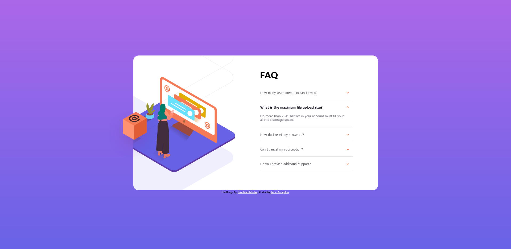

# Frontend Mentor - FAQ accordion card solution

This is a solution to the [FAQ accordion card challenge on Frontend Mentor](https://www.frontendmentor.io/challenges/faq-accordion-card-XlyjD0Oam). Frontend Mentor challenges help you improve your coding skills by building realistic projects.

## Table of contents

- [Overview](#overview)
  - [The challenge](#the-challenge)
  - [Screenshot](#screenshot)
  - [Links](#links)
- [My process](#my-process)
  - [Built with](#built-with)
  - [What I learned](#what-i-learned)
  - [Continued development](#continued-development)
  - [Useful resources](#useful-resources)
- [Author](#author)

## Overview

### The challenge

Users should be able to:

- View the optimal layout for the component depending on their device's screen size
- See hover states for all interactive elements on the page
- Hide/Show the answer to a question when the question is clicked

### Screenshots

 

### Links

- Live Site URL: [https://accordion-card-hub.vercel.app/](https://accordion-card-hub.vercel.app/)

## My process

### Built with

- Semantic HTML5 markup
- CSS custom properties
- Flexbox

### What I learned

```css
.test::after {
  content: "";
  height: 1px;
  margin: 0 auto;
  left: 0;
  width: 348px;
  background: #e8e8e8;
  position: relative;
  top: 0px;
  display: block;
}
```

This is the code I used to create the lines between each question. Psudo elements are important.

```js
this.classList.toggle("active");
```

I found out about the toggle method from the W3Schools tutorial I read. Although I don't think it's best to use a toggle in this situation, I will definetly be using it in the future.

### Continued development

When I was creating the HTML outline for this project, I didn't take the mobile view into account. For this project it was an easy enough fix, but in the future I need to plan my HTML better.

### Useful resources

- [How to Make an Accordion Menu](https://www.w3schools.com/howto/howto_js_accordion.asp) - This helped me understand the logic behind the menu and how to layout my HTML. I ended up rewriting it so that it would close the open question when opening a different question.

## Author

- Website - [Julia Arrington](https://www.juliaarrington.com)
